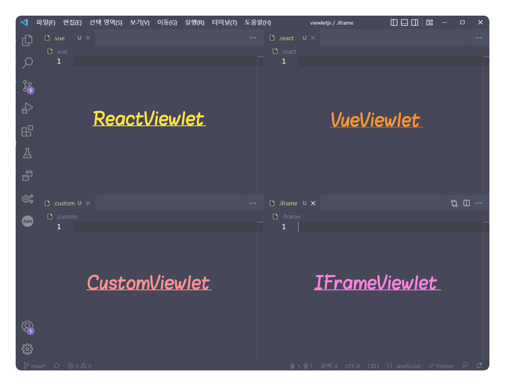

# ViewletJS

### Prologue

수개월에 걸처 React library를 사용하여 UI Framework를 개발 하였다. 

다양한 컴포넌트는 Atomic Design Pattern을 기반으로 정교하게 설계되었다.

비즈니스 로직의 재활용성을 높이기 위해 redux store를 컴포넌트 밖으로 꺼내 비즈니스 로직(reducer)을 동적으로 주입할 수 있게 되었다.

이로 인해 비즈니스 로직 개발자는 더이상 리액트니, 리덕스니 복잡 다양한 FrontEnd 세계에 대한 이해 없이 비즈니스 로직에 집중 할수 있게 되었다.

UI 비즈니스 로직은 웹서버 없이 개발환경(nodejs)에서 독립적으로 실행되며 TDD를 적용할 수 있게 되었다.

UI Core 로직과 UI 비즈니스 로직을 완전하게 분리하였다.

이로서 목표하던 바를 이루었다!

 
 

그런데..

react보다 훨씬 빠르고 안정적인 라이브러리가 나온다면 어떻게 될까..

프레임워크를 갈아 엎어야 할까?

기존 비즈니스 로직들은 프레임워크가 변경돼도 그대로 동작할까?

새로운 라이브러리를 react와 함께 사용할 수는 없을까?

앞으로 계속 더 좋은 라이브러리가 나올텐데 그때는 또 어떻게 해야 할까?

 
 

>좋은 코드란 한번 작성하고 변경되지 않는 코드가 아니라, 변하는 요구사항을 유연하게 수용할 수 있는 코드이다.  
>마찬가지로 좋은 프레임워크란 특정 플랫폼이나 라이브러리에 의존하기 보다는 다양한 환경하에서 독립적으로 실행될 수 있는 프레임워크일 것이다.

 
 

10년 후에도 생명력을 가지는 Framework를 만들려면 어떻게 해야 할까?

대체 무엇이 변하고 무엇이 변하지 않는 것일까?

Clean Architecture가 지향하는 계층의 분리와 의존성의 규칙을 웹 환경에 어떻게 적용할 수 있을까?

 
 

### Concept

<ins>`vscode`의 viewlet, slit view등과 같은 Layout System에 영감을 받아 이 프로젝트는 시작되었다.</ins>

#### [viewlet]

>(computing) In certain content management systems, a region of a page where customizable content can be rendered.  
>(컴퓨팅) 특정 콘텐츠 관리 시스템에서 사용자 지정 가능한 콘텐츠를 렌더링할 수 있는 페이지 영역

 
 

vscode가 다양한 파일의 확장자를 기반으로 각 파일에 대한 부가 기능들을 독립적으로 싷행하는 것처럼, 

ViewletJS를 통해 다양한 라이브러리로 개발된 각각의 페이지를 독립적으로 실행하고자 한다.

  
 
### Goal

ViewletAdoptor를 통해 어떠한 형태의 `viewlet`도 등록, 실행할 수 있다.

각 `viewlet`은 독립적인 랜더링 파이프를 구축 할수 있다(react, vue등)

ViewletJS는 모든 `viewlet`의 생명주기를 제어하며, 자유롭게 `viewlet`을 배치 할수 있다.

ViewletJS에서 제공하는 주요 기능은 각 `viewlet`에 주입되어 재사용 된다.

주요 Business Rule은 각 `viewlet`에 주입되어 재사용 된다.

  

### Practice

1. 플랫폼 독립적인 ViewletJS 프레임워크의 구조 설계

여기서의 플랫폼은 넓은 의미로 web, mobile, nodejs등의 javascript 런타임 환경을 의마한다.

우리가 개발한 프레임워크가 플랫폼 독립적으로 동작하려면 어떻게 해야 할까?

각 플랫폼을 초월해서 동작하는 코드를 작성하는 것은 불가능하기 때문에 플랫폼에 종속적인 코드는 외부에서 주입 받아야 한다.

몇가지 주요 모듈을 설계하면서 각 플랫폼 기반의 주요 모듈을 어떻게 프레임워크에 주입하여 사용하는지에 대해 학습해 본다.

3. React와 Vue를 이용하여 ReactViewlet, VueViewlet 모듈 개발

ViewletAdoptor -> ReactViewlet <- ReactViewletHandler
                               <- ReactViewletRenderer
                               
ViewletAdoptor -> VueViewlet <- VueViewletHandler
                             <- VueViewletRenderer
                               

4. ReactViewlet, VueViewlet을 이용한 입력 화면 개발[(viewlet-apps)](https://github.com/dknam/viewlet-apps)
5. 파일업로드 기능 개발을 통한 관심사의 분리 방법(ui 로직과 비즈니스 로직의 분리, 의존성 주입)
6. ViewletJS 통합 개발 환경 개발[(Viewlet-Workbench)](https://github.com/dknam/viewlet-workbench)
